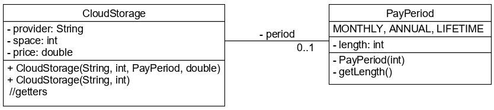

# Gyakorlati feladatok

Írj egy `Numbers` osztályt, mely képes a következőkre:

* Kap egy List<Integer> (páros számú), visszaad egy List<Integer>, párokba rendezi, összeadja
* Kap egy List<Integer> (páros számú), visszaad egy List<Integer>, párokba rendezi, szorozza

Hozz létre egy `Product` osztályt, aminek van `price`, `bonusPrice` attribútuma!
Hozz létre egy `Products` osztályt, abban egy `int sum(List<Product>, ...)`,
hogy mi alapján összegezzen. (Történhet price, bonusPrice alapján is.)

## Felhő tárhelyek

Különböző felhő tárhely szolgáltatókat szeretnénk összehasonlítani, ezért a `CloudStorage` osztályban 
eltároljuk a különböző adataikat. A tárhely mérete GB-ban adott, az árak pedig mindenhol ugyanabban a pénznemben. 
A `PayPeriod` enum a fizetési gyakoriság, ahol a `length` értéke a hossz hónapokban megadva (lifetime esetén 60 hónap). 
Az ingyenes csomagok esetén a fizetési gyakortiság nincs megadva. A 
`CloudStorage` implementálja a `Comparable` interfészt, a természetes rendezettségét az 1000 GB-ra eső éves díj nagysága adja.

A `Clouds` osztály metódusai a paraméterként kapott listából bizonyos szempont szerint a legjobba(ka)t adják vissza. 
Amennyiben több ugyanolyan van, akkor közülük bármelyik visszaadható.

* `alphabeticallyFirst()`: a szolgáltató neve alapján betűrendben a legelső `CloudStorage`. Kis-nagybetű nem számít.
* `bestPriceForShortestPeriod()`: a legrövidebb időszakra vonatkozó legolcsóbb `CloudStorage`. Ha van 
ingyenes, akkor azok közül bármelyik megadható.
* `worstOffers()`: a természetes rendezettség szerinti 3 legrosszabb ajánlat.

## Alkalmazottak

Hozzatok létre egy `Employee` osztályt, `String name`, `int salary`, `String position` attribútumokkal!
A `findEmployees(List<Employee> employees)` metódus adja vissza a `boss` pozícióban lévő alkalmazottak nevét, fizetés alapján sorbarendezve!

## Számoló

Írjatok egy `counter.Counter` nevezetű osztályt! Legyen benne egy `int countEven(List<Integer> numbers)` metódus.
Számolja meg, hogy a listában hány darab páros szám szerepel! Streamekkel!

Legyen benne egy `CounterResult countNumbers(List<Integer> numbers)`. Ez egy bejárással számolja meg, hogy hány negatív, és hány pozitív
szám van benne! Nullát ne számoljátok sehova! Ciklusokkal. `CounterResult`, immutable legyen! Legyen neki konstruktora, és
csak getterei! Ne legyen settere!

## Bevezetés a JUnit használatába

A `locations` csomagba dolgozz!

Hozz létre egy `Location` osztályt,
`name`, `lat`, `lon` attribútumokkal! A `name` attribútum `String` típusú legyen!
A szélességi és hosszúsági koordinátákat
külön `double` típusú attribútummal ábrázold!

Legyenek getter/setter metódusai, és konstruktora, ahol mind a
három attribútumát meg lehet adni!

Hozz létre egy `LocationParser` osztályt, mely feladata szöveges értékből
kinyerni egy kedvenc hely adatait!
Legyen egy `public Location parse(String text)` metódusa, mely a nevet és a
koordinátákat vesszővel elválasztva várja (pl. `Budapest,47.497912,19.040235`)! A tizedeshatároló karakter legyen a
pont! Ez a metódus visszaad egy új példányt, kitöltve a megfelelő attribútum értékekkel.
Írj rá egy `LocationTest` osztályt, valamint egy `testParse()` metódust,
mely ezt a metódust teszteli!
